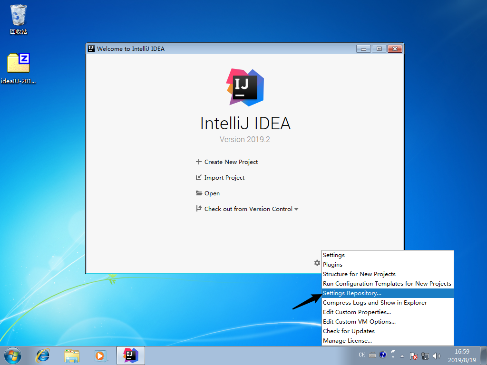
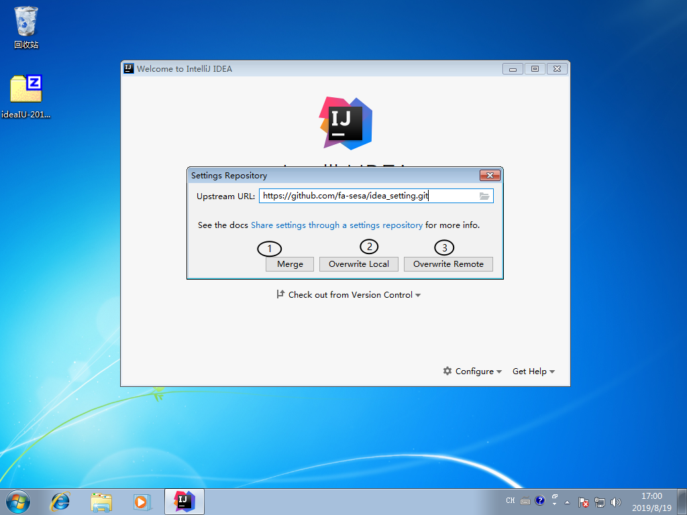
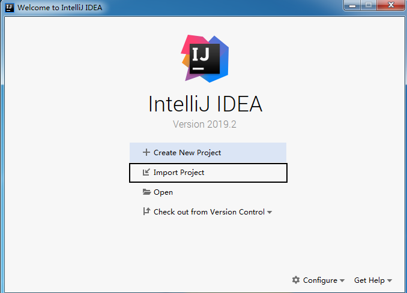
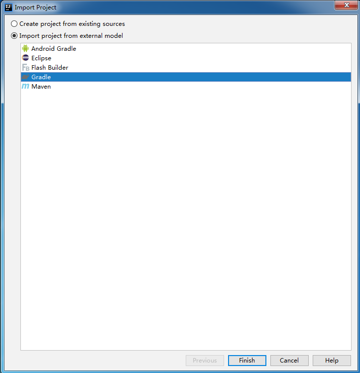
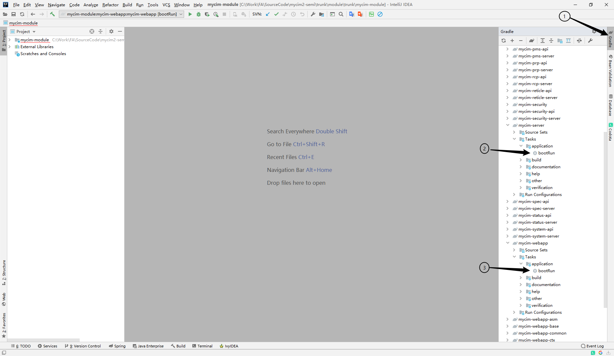

# IDEA安装使用

## 使用FTP中的IDEA安装包

### 1. 下载地址
 > FTP地址：

### 2. 运行程序
 > 运行ideaIU-2019.2.win\bin\idea64.exe

   

### 3. 设置新项目JDK

 
 
 > 点击新建，选择本地的J8K8的安装目录，完成后点击OK回到启动器

### 4. 更新设置

 
 
 > 1 合并远端仓库和本地设置，如遇到冲突，会弹出选择框，要求以远端仓库优先  
 > 2 使用远端仓库覆盖本地设置  
 > 3 使用本地设置覆盖远端仓库，**任何人不得使用本项设置**  

### 5. 导入项目

 > 点击导入按钮，选择项目目录

 
 > 如图选择按Gradle项目导入

 
 > 等待项目导入成功

### 6. 运行项目

 
 > 1： 选择右侧面板的Gradle  
 > 2： 运行Server模块的Gradle Task：bootRun  
 > 3： 运行Webapp模块的Gradle Task: bootRun
