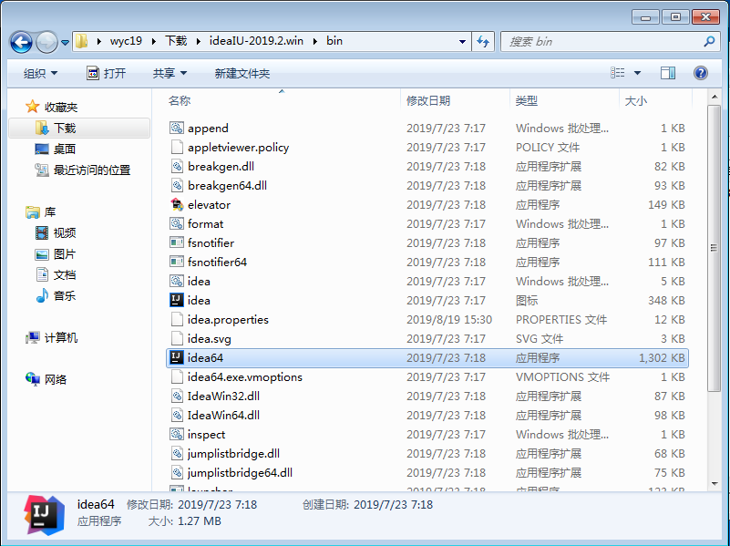
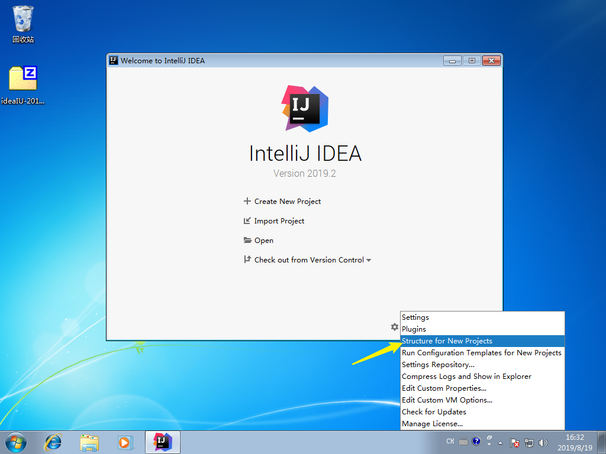
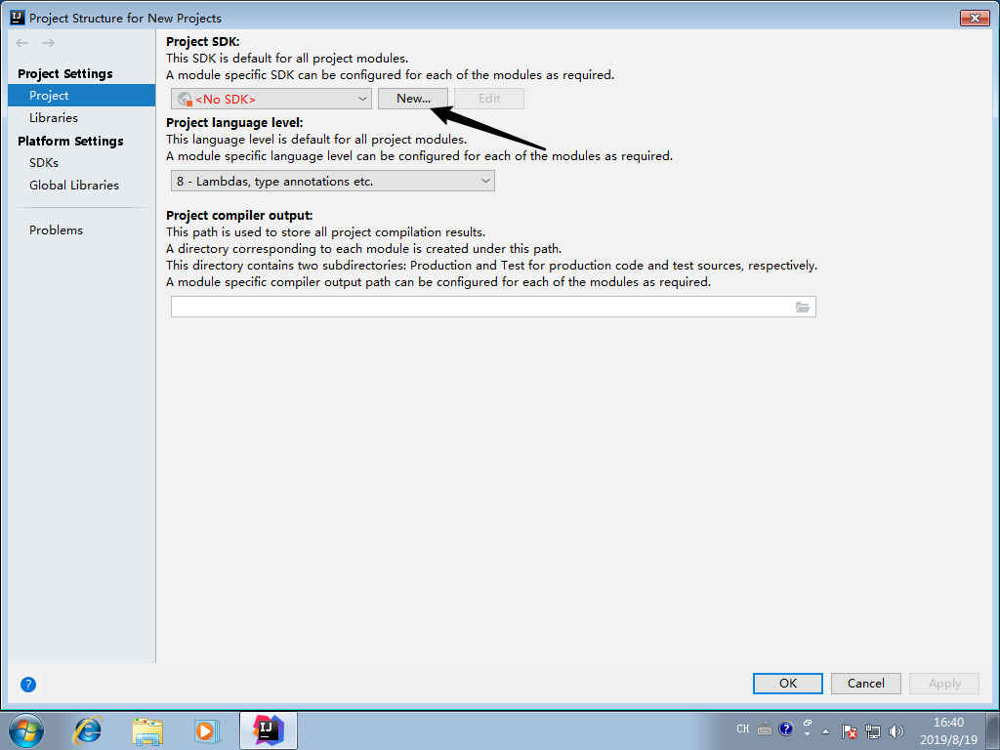
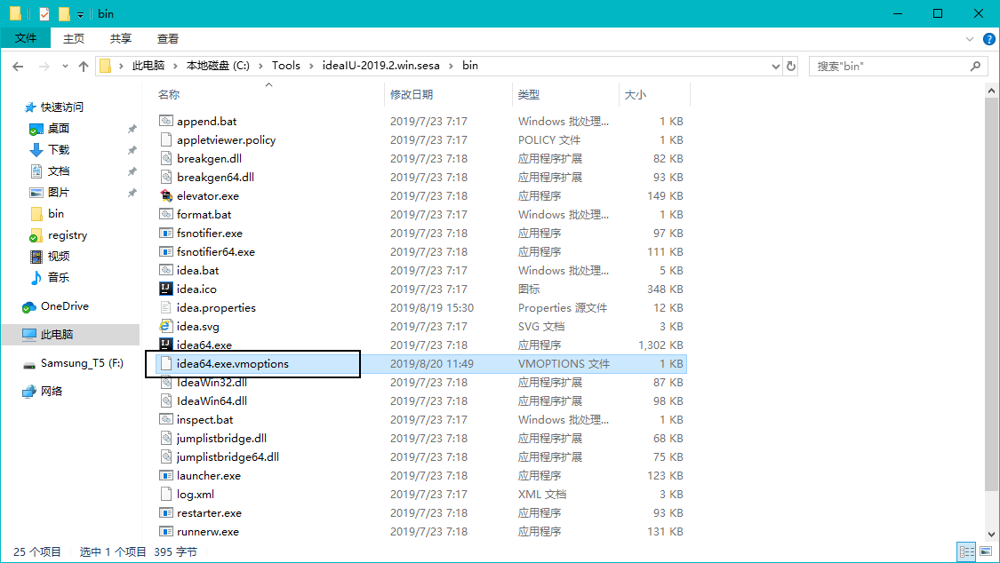
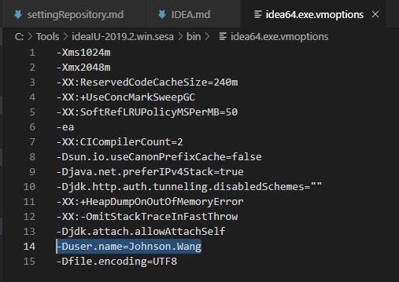
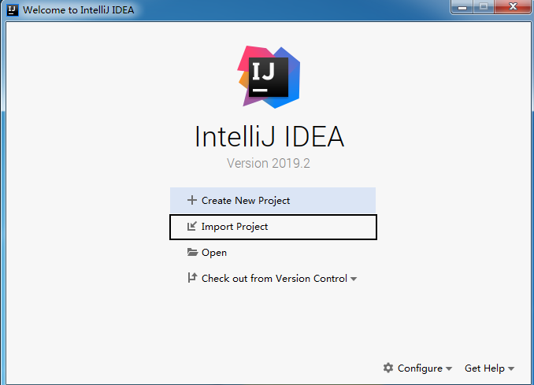
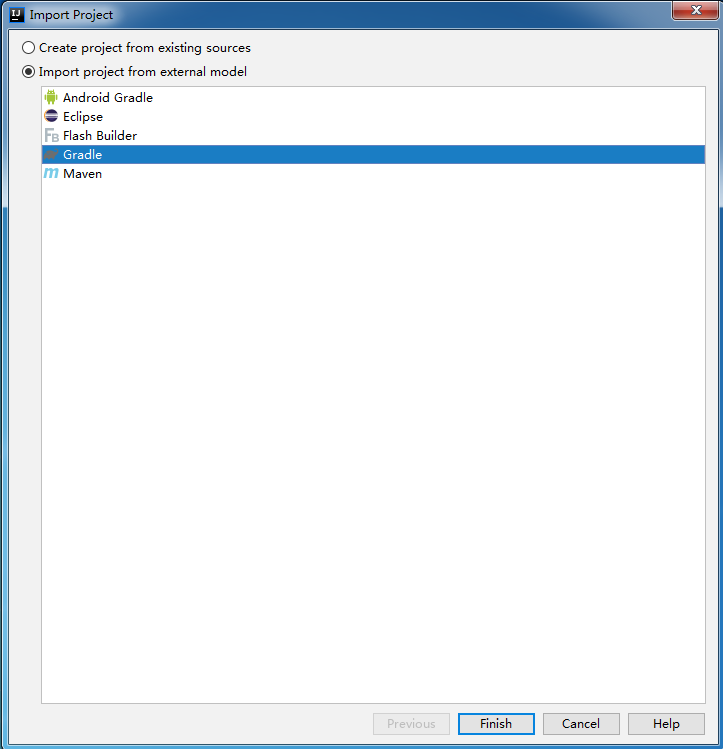
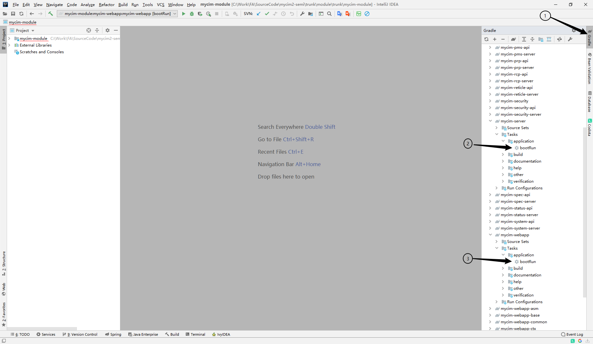

# IDEA安装使用

## 1. 下载地址

 > FTP地址：

## 2. 运行程序

 > 运行ideaIU-2019.2.win\bin\idea64.exe

   

## 3. 导入设置

 > **参考其他文章[IDEA设置项导入](idea/importSetting 'IDEA设置项导入')**

## 3. 设置新项目JDK

 
 
 > 点击新建，选择本地的J8K8的安装目录，完成后点击OK回到启动器

## 4. 修改用户名

 > 1. 打开IDEA的bin目录，找到**idea64.exe.vmoptions**
 
 > 2. 编辑文件，修改**Duser.name=自己的svn名称**
 

## 5. 导入项目

 > 点击导入按钮，选择项目目录

 
 > 如图选择按Gradle项目导入

 
 > 等待项目导入成功

## 6. 运行项目

 
 > 1： 选择右侧面板的Gradle  
 > 2： 运行Server模块的Gradle Task：bootRun  
 > 3： 运行Webapp模块的Gradle Task: bootRun
