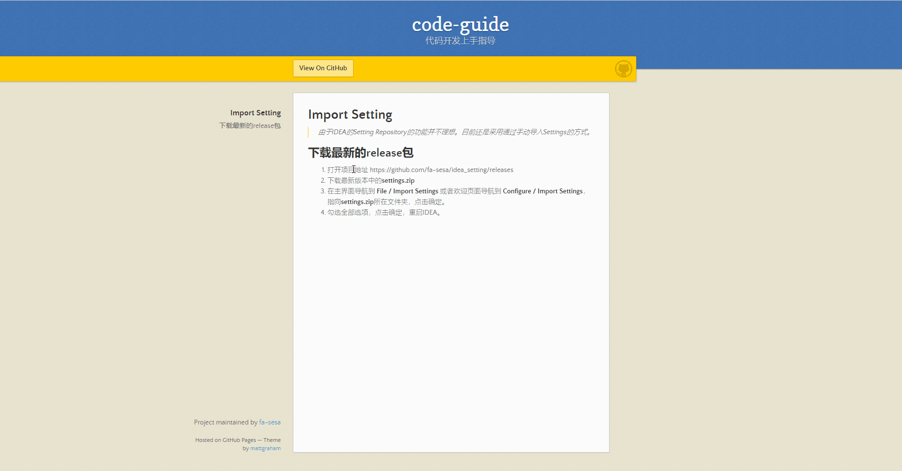

# Import Setting

> 由于IDEA的Setting Repository的功能并不理想。目前还是采用通过手动导入Settings的方式。

 1. 打开项目地址 https://github.com/iamcyw/idea-settings/releases ，下载最新版本中的**settings.zip**
   
 2. 在主界面导航到 **File / Import Settings** 或者欢迎页面导航到 **Configure / Import Settings**，指向**settings.zip**所在文件夹，点击确定。勾选全部选项，点击确定，重启IDEA。
   
