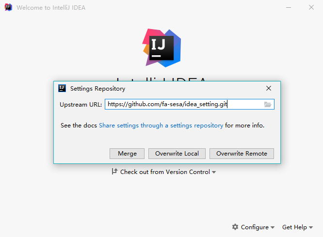

# IDEA Setting Repository

> Setting Repository 是一种通过在仓库中托管IDEA的设置项，在多个IDEA实例中进行设置同步的方式。推荐在团队协同开发中使用该方法实现统一开发环境。

## 配置 Settings Repository

 1. 在主界面导航到 **File | Settings Repository** 或者欢迎页面导航到 **Configure | Settings Repository**
 

 2. 在Upstream Url中添加 https://github.com/fa-sesa/idea_setting.git
 

 3. 然后点击 **Overwrite Local**。 如果想要储存库保留远程设置和本地设置的组合，可以点击 **Merge**。如果检测到任何冲突，将显示一个对话框，可以在其中解决这些冲突。  
 **任何人不得使用 **Overwrite Remote****

## 配置只读库

 > 除了 **Settings Repository**，还可以配置任意数量的其他存储库，其中包含要共享的任何类型的设置，包括实时模板、文件模板、方案、部署选项等。
这些存储库被称为只读源，因为它们不能被覆盖或合并，仅用作设置源。
要配置此类存储库。**通常情况下，开发人员只需要在IDEA中配置只读库以达到同步远程设置到本地的效果。**  
通过其他只读存储库共享更多设置 请执行以下操作：

1. 在 **Settings / Preferences Dialog** 对话框中，展开 **Tools** 节点，然后选择 **Settings Repository**。  
2. 单击“+”并添加包含要共享设置的仓库的 URL。

